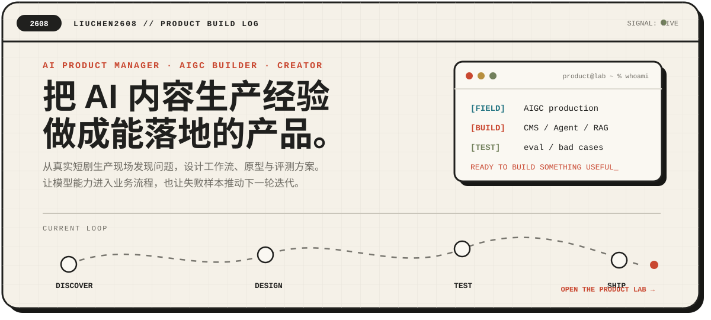

  

  <b>从 AI 内容生产现场走向 AI 产品经理</b> 
  AIGC · Agent · RAG · 产品设计 · 模型评测

---

## 关于我

计算机专业本科，有两年服役经历，也参与过真实的 AI 短剧生产。

我做过生图、生视频、角色与场景一致性、模型测试和剪辑，也参与需求讨论、产品测试、CMS 设计与研发对接。现在专注于把一线业务问题转化为可验证、可落地的 AI 产品方案。

| DISCOVER | DESIGN | TEST | SHIP |
| --- | --- | --- | --- |
| 从生产流程和 bad case 中发现问题 | 拆解需求、流程与产品边界 | 建立评测集并验证效果 | 推动上线并持续迭代 |

## 当前关注

~~~text
[FIELD]  AIGC 短剧内容生产
[BUILD]  CMS / Agent / RAG 产品
[TEST]   模型评测 / bad case 分析
[GOAL]   AI 产品经理求职与项目实践
~~~

## 代表项目

### 大象阿宝 · 健康生活助手

面向普通成年人的生活方式问答产品，围绕饮食、作息和运动提供日常建议，同时严格限制医疗诊断与用药内容。

[查看项目 →](https://github.com/liuchen2608/daxiangabao)

### 情景英语练习

通过真实场景、选择式对话和即时反馈，让用户练习能够马上使用的英语表达。

[查看项目 →](https://github.com/liuchen2608/english-learning-software)

### AI 产品笔记

围绕 RAG、Agent、模型选型、评测和产品决策沉淀的学习与实践记录。

[查看项目 →](https://github.com/liuchen2608/AI-Product-Notes)

## 产品工作方法

~~~mermaid
flowchart LR
    A[发现问题] --> B[定义需求]
    B --> C[设计方案]
    C --> D[评测验收]
    D --> E[上线迭代]
~~~

## 技能与工具

<code>AIGC 内容生产</code> · <code>Prompt</code> · <code>Dify</code> · <code>RAG</code> · <code>Agent Workflow</code> · <code>模型评测</code> · <code>PRD</code> · <code>原型设计</code> · <code>GitHub</code>

---

  <a href="https://github.com/liuchen2608">GitHub</a>
  ·
  <a href="./index.html">个人网站源码</a>

